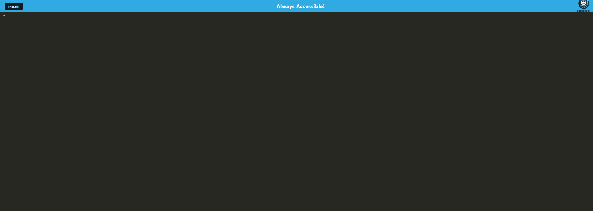
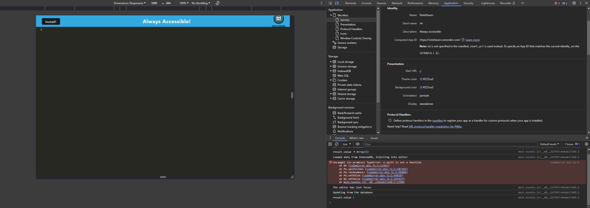

# NoteHaven

https://notehaven.onrender.com/

## Description
The motive behind this project was to create an something that would allow me to write down notes that would work online and offline and keep my work saved. Thus, the creation of Note Haven was best for this task. 
Along the way I learned various new concepts and new tools to add to my tool belt. Some being the following: 
* The importance of downloading your files correctly where they belong. At first I stumbled upon a surprisingly common issue of downloading some packages in the wrong package file. I would not run the proper commands to make sure all packages were generated which would led to a lot of wasted time while trying to go back and figure out what was wrong. 
* Asking for help. For about a solid 15+ hours I got stuck trying to solve 2 errors when I would do my ``npm run start:dev``. First issue being, in terminal after running this I would get an error stating that my inject manifest was being called multiple times. This was resolved after Jay (our Teacher) suggested to change in my server.js file the ``return result`` in my getDB with ``return result?.value``. Second issue was (as shown in image below) ``TypeError: e.split is not a funtion``; which is still currently not solved (on my end) after various debugging attempts from Maria (T.A) and Jay (Teacher). 

## Table of Contents
-[Descriptions](#Descriptions)
-[Installation](#Installation)
-[Usage](#Usage)
-[Credits](#Credits)
-[Tests](#Tests)
-[License](#License)
-[Questions](##Questions)

## Installation
In order to install this project you will have to clone the repository: 
    1. Create a place where you will want to store all this information 
    2. Once there open GitBash
    3. Clone this repository into the file you will have this stored in
            enter following: git@github.com:juanthtgotaway/NoteHaven.git
    4. Press enter to create your local clone

## Usage
This can be used to jot down notes! 

## Credits
Huge credits to Maria and Jay for their assistance trying to help me get my project up and running! 

## Tests
N/A
## License
MIT

## Questions
If you have any questions or concerns feel free to reach out via the following:
GitHub:[juanthtgotaway](https://github.com/juanthtgotaway)